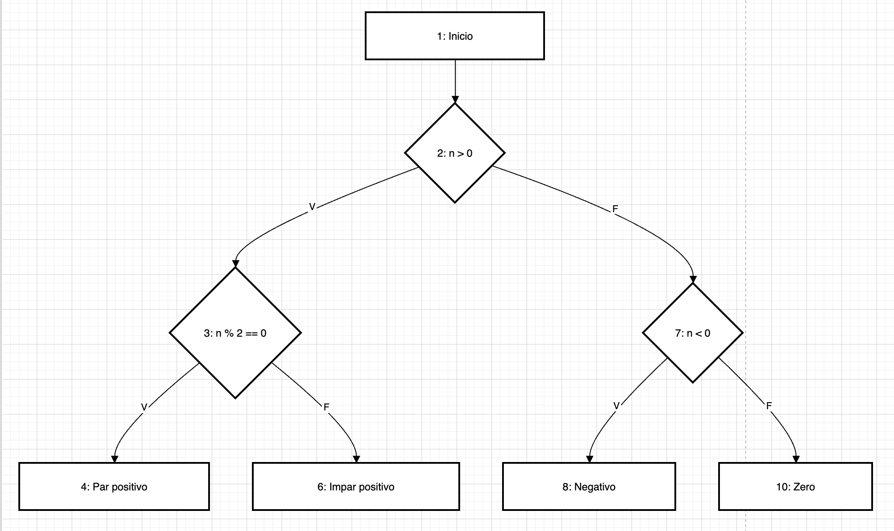
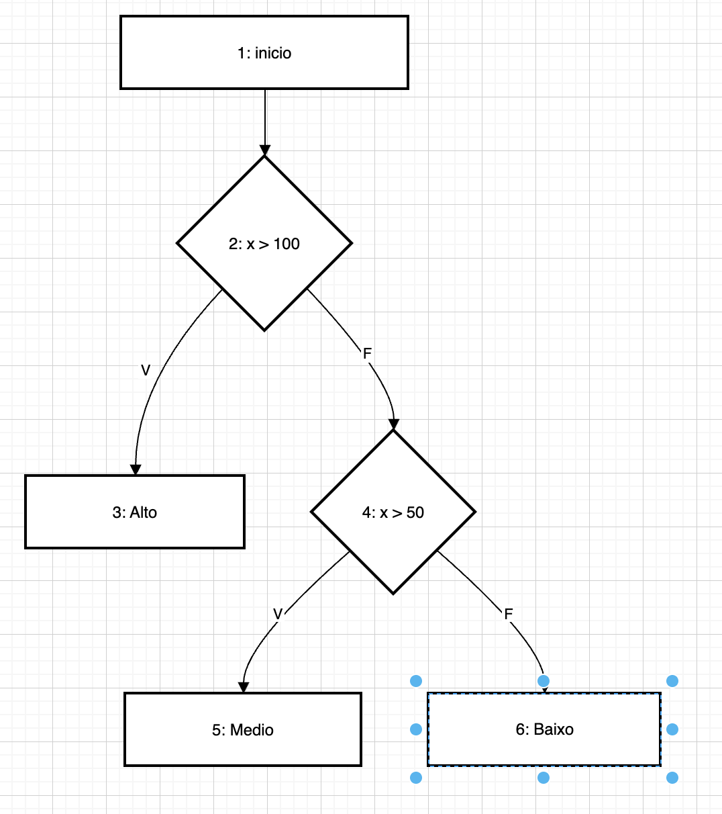
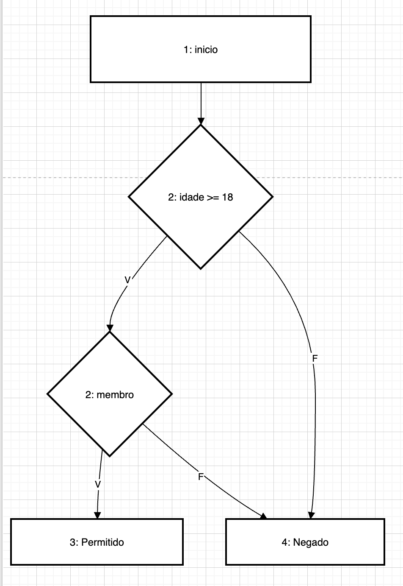
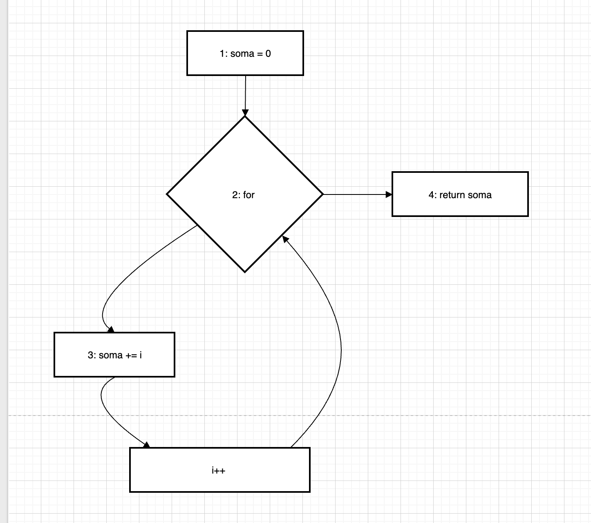
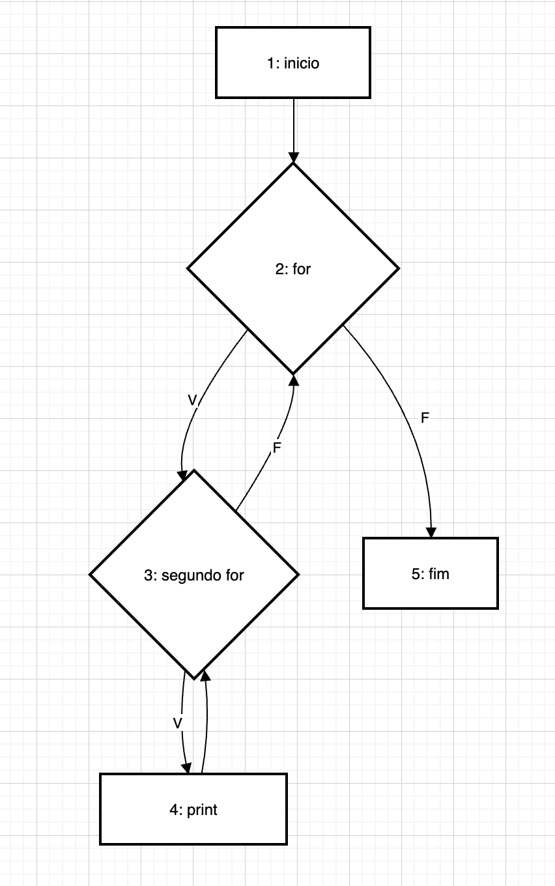
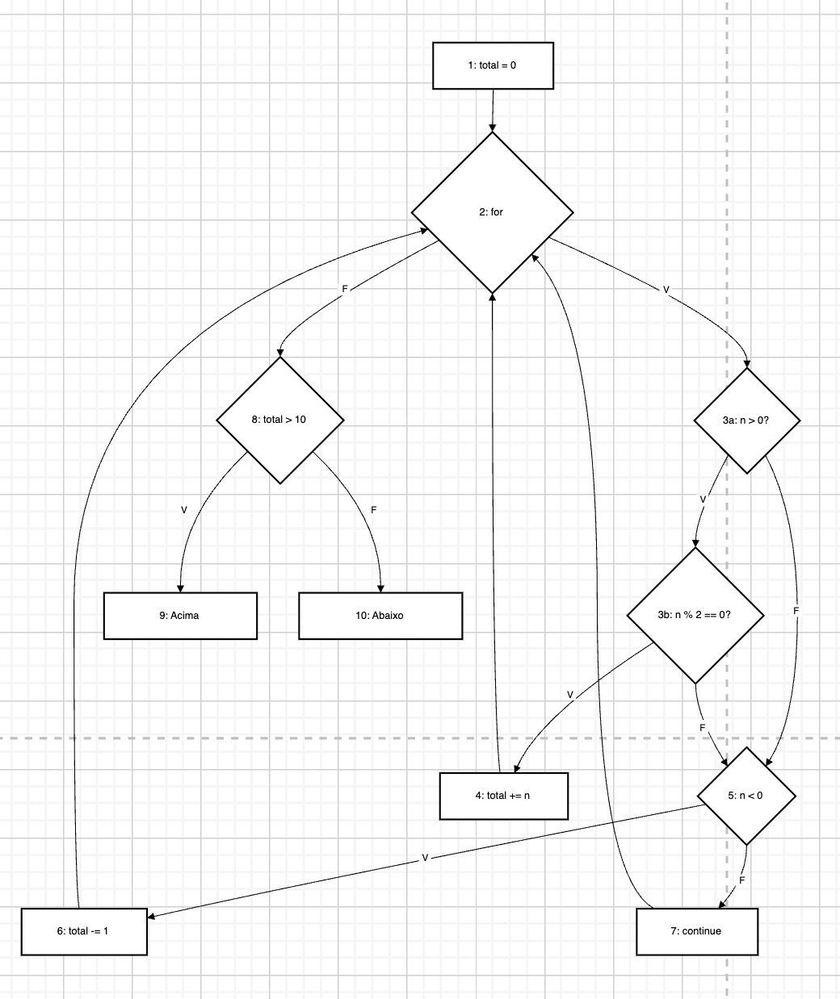
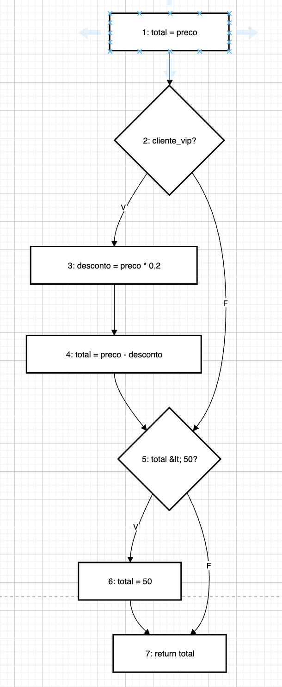

# Atividade 04 - Técnicas Caixa-Branca: Critérios de Cobertura Estrutural

## Exercício 1 - Caminhos Independentes

```python
def verificar(n):
    if n > 0:
        if n % 2 == 0:
            return "Par positivo"
        else:
            return "Impar positivo"
    elif n < 0:
        return "Negativo"
    else:
        return "Zero"
```

### Grafo de Fluxo de Controle (GFC)


### Complexidade Ciclomática

- **V(G) = 3 +1 = 4

### Caminhos Independentes

| Caminho | Percurso | Condição |
|---------|----------|----------|
| C1 | 1→2→3→4 | n > 0 e n par |
| C2 | 1→2→3→5 | n > 0 e n ímpar |
| C3 | 1→2→6→7 | n < 0 |
| C4 | 1→2→6→8 | n == 0 |

### Casos de Teste

| CT | Entrada (n) | Saída Esperada |
|----|-------------|----------------|
| CT1 | 4 | "Par positivo" |
| CT2 | 3 | "Impar positivo" |
| CT3 | -5 | "Negativo" |
| CT4 | 0 | "Zero" |

---

## Exercício 2 - Cobertura de Comandos e Ramos

### Código

```python
def classificar(x):
    if x > 100:
        return "Alto"
    if x > 50:
        return "Medio"
    return "Baixo"
```

### Grafo de Fluxo de Controle (GFC)



### Complexidade Ciclomática

- **V(G) = 2 + 1 = 3**

### Caminhos Independentes

| Caminho | Percurso | Condição |
|---------|----------|----------|
| C1 | 1→2→3 | x > 100 |
| C2 | 1→2→4→5 | 50 < x ≤ 100 |
| C3 | 1→2→4→6 | x ≤ 50 |

### Casos de Teste

| CT | Entrada (x) | Saída Esperada | Ramos cobertos |
|----|-------------|----------------|----------------|
| CT1 | 150 | "Alto" | 2→V |
| CT2 | 75 | "Medio" | 2→F, 4→V |
| CT3 | 30 | "Baixo" | 2→F, 4→F |

---

## Exercício 3 - Cobertura de Condição

### Código

```python
def acesso(idade, membro):
    if idade >= 18 and membro:
        return "Permitido"
    return "Negado"
```

### Grafo de Fluxo de Controle (GFC)


### Complexidade Ciclomática

- **V(G) = 2 + 1 = 3**

### Caminhos Independentes

| Caminho | Percurso | Condição |
|---------|----------|----------|
| C1 | 1→2a→2b→5 | idade >= 18 e membro = True |
| C2 | 1→2a→2b→4 | idade >= 18 e membro = False |
| C3 | 1→2a→4 | idade < 18 |

### Casos de Teste para Cobertura de Condição (CC)

Cada condição deve ser verdadeiro e false pelo menos uma vez:
- `idade >= 18`: V e F
- `membro`: V e F

| CT | idade | membro | idade>=18 | membro | Saída |
|----|-------|--------|-----------|--------|-------|
| CT1 | 20 | True | V | V | "Permitido" |
| CT2 | 20 | False | V | F | "Negado" |
| CT3 | 15 | True | F | (curto-circuito) | "Negado" |
| CT4 | 15 | False | F | (curto-circuito) | "Negado" |

### Comparação C1 vs CC

| Critério | CTs mínimos | 
|----------|-------------|
| Cobertura de Ramos (C1) | 3 | 
| Cobertura de Condição (CC) | 2  | 

---

## Exercício 4 - Teste de Ciclo

### Código

```python
def somar_ate(n):
    soma = 0
    for i in range(n):
        soma += i
    return soma
```

### Grafo de Fluxo de Controle (GFC)


### Complexidade Ciclomática

- **V(G) = 5 - 5 + 2 = 2**

### Caminhos Independentes

| Caminho | Percurso | Condição |
|---------|----------|----------|
| C1 | 1→2→5 | n ≤ 0 (laço ignorado) |
| C2 | 1→2→3→4→2→5 | n > 0 (laço executado) |

### Casos de Teste

| CT | Entrada (n) | Iterações | Cenário | Saída Esperada |
|----|-------------|-----------|---------|----------------|
| CT1 | 0 | 0 | Laço ignorado | 0 |
| CT2 | 1 | 1 | Laço 1 vez (i=0) | 0 |
| CT3 | 5 | 5 | Laço várias vezes (i=0,1,2,3,4) | 0+1+2+3+4 = **10** |

---

## Exercício 5 - Teste de Ciclo Aninhado

### Código

```python
def percorrer_matriz(m, n):
    for i in range(m):
        for j in range(n):
            print(f"Posicao ({i}, {j})")
```

### Grafo de Fluxo de Controle (GFC)


### Complexidade Ciclomática

- **V(G) = 6 - 5 + 2 = 3**

### Caminhos Independentes

| Caminho | Percurso | Condição |
|---------|----------|----------|
| C1 | 1→2→5 | m=0 (ambos ignorados) |
| C2 | 1→2→3→2→5 | m>0, n=0 (só j ignorado) |
| C3 | 1→2→3→4→3→2→5 | m>0, n>0 (ambos executam) |

### Casos de Teste

| CT | m | n | Cenário | Execuções do print |
|----|---|---|---------|--------------------|
| CT1 | 0 | 0 | Ambos laços ignorados | **0** |
| CT2 | 2 | 0 | Apenas laço j ignorado | **0** |
| CT3 | 1 | 3 | Laço i=1 vez, laço j=várias vezes | **3** (1×3) |
| CT4 | 3 | 3 | Ambos laços várias vezes | **9** (3×3) |

---

## Exercício 6 - Teste Completo (Integrador)

### Código

```python
def analisar(numeros):
    total = 0
    for n in numeros:
        if n > 0 and n % 2 == 0:
            total += n
        elif n < 0:
            total -= 1
        else:
            continue
    if total > 10:
        return "Acima"
    return "Abaixo"
```

### Grafo de Fluxo de Controle (GFC)



### Complexidade Ciclomática

- **V(G) = 5 + 1 = 6**

### Caminhos Independentes

| Caminho | Percurso | Descrição |
|---------|----------|-----------|
| C1 | 1→2→11 | Lista vazia, laço ignorado |
| C2 | 1→2→3a→3b→4→9→2→11 | n par positivo, total ≤ 10 |
| C3 | 1→2→3a→5→6→9→2→11 | n negativo, total ≤ 10 |
| C4 | 1→2→3a→3b→7→2→11 | n ímpar positivo (continue) |
| C5 | 1→2→3a→5→7→2→11 | n=0 (continue) |
| C6 | 1→2→3a→3b→4→9→10 | n par positivo, total > 10 |

### Casos de Teste

**Cobertura de Comandos (C0) e Ramos (C1):**

| CT | Entrada | Saída | Cobertura |
|----|---------|-------|-----------|
| CT1 | [] | "Abaixo" | Laço 0 iterações |
| CT2 | [4] | "Abaixo" | n>0 e par → total=4, total≤10 |
| CT3 | [-1] | "Abaixo" | n<0 → total=-1 |
| CT4 | [3] | "Abaixo" | n>0 e ímpar → continue |
| CT5 | [0] | "Abaixo" | n=0 → continue (else) |
| CT6 | [12] | "Acima" | n>0 e par → total=12 > 10 |
| CT7 | [4, 8] | "Acima" | Várias iterações, total=12 > 10 |

**Cobertura de Condição (CC) para `n > 0 and n % 2 == 0`:**

| CT | n | n > 0 | n % 2 == 0 | Resultado da condição |
|----|---|-------|------------|----------------------|
| CT2 | 4 | V | V | V |
| CT4 | 3 | V | F | F |
| CT3 | -1 | F | (curto-circuito) | F |

**Pares def-uso de `total`:**

| Par | Definição (def) | Uso (use) | Tipo |
|-----|-----------------|-----------|------|
| DU1 | Linha 2 (total=0) | Linha 4 (total += n) | c-use |
| DU2 | Linha 2 (total=0) | Linha 6 (total -= 1) | c-use |
| DU3 | Linha 2 (total=0) | Linha 9 (total > 10) | p-use |
| DU4 | Linha 4 (total+=n) | Linha 9 (total > 10) | p-use |
| DU5 | Linha 4 (total+=n) | Linha 4 (total += n) | c-use (próx. iteração) |
| DU6 | Linha 6 (total-=1) | Linha 9 (total > 10) | p-use |
| DU7 | Linha 6 (total-=1) | Linha 4 (total += n) | c-use (próx. iteração) |
| DU8 | Linha 6 (total-=1) | Linha 6 (total -= 1) | c-use (próx. iteração) |
| DU9 | Linha 2 (total=0) | Linha 11 (return total implícito) | c-use |

---

## Exercício 7 - Fluxo de Dados

### Código

```python
def desconto(preco, cliente_vip):
    total = preco
    if cliente_vip:
        desconto = preco * 0.2
        total = preco - desconto
    if total < 50:
        total = 50
    return total
```

### Definições e Usos de cada variável

**Variável `preco`:**
| Tipo | Linha | Contexto |
|------|-------|----------|
| def | 1 | Parâmetro |
| uso | 2 | total = preco |
| uso | 4 | desconto = preco * 0.2 |
| uso | 5 | total = preco - desconto |

**Variável `cliente_vip`:**
| Tipo | Linha | Contexto |
|------|-------|----------|
| def | 1 | Parâmetro |
| uso | 3 | if cliente_vip (p-use) |

**Variável `total`:**
| Tipo | Linha | Contexto |
|------|-------|----------|
| def | 2 | total = preco |
| def | 5 | total = preco - desconto |
| def | 7 | total = 50 |
| uso | 6 | if total < 50 (p-use) |
| uso | 8 | return total (c-use) |

**Variável `desconto`:**
| Tipo | Linha | Contexto |
|------|-------|----------|
| def | 4 | desconto = preco * 0.2 |
| uso | 5 | total = preco - desconto |

### Grafo de Fluxo de Controle (GFC)



### Pares Def-Uso (du-pairs)

| # | Variável | Def (linha) | Uso (linha) | Caminho |
|---|----------|-------------|-------------|---------|
| 1 | preco | 1 | 2 | 1→2 |
| 2 | preco | 1 | 4 | 1→2→3→4 |
| 3 | preco | 1 | 5 | 1→2→3→4→5 |
| 4 | cliente_vip | 1 | 3 | 1→2→3 (p-use) |
| 5 | total | 2 | 6 | 1→2→5 (quando não VIP) |
| 6 | total | 2 | 8 | 1→2→5→7 (não VIP, total≥50) |
| 7 | total | 5 | 6 | 3→4→5 (VIP) |
| 8 | total | 5 | 8 | 3→4→5→7 (VIP, total≥50) |
| 9 | total | 7 | 8 | 6→7 |
| 10 | desconto | 4 | 5 | 4→5 |

### Casos de Teste

**All-Defs:**

| CT | preco | cliente_vip | Execução | Saída | Defs cobertas |
|----|-------|-------------|----------|-------|---------------|
| CT1 | 100 | True | total=100→desc=20→total=80→80≥50 | 80 | total(2), total(5), desconto(4) |
| CT2 | 100 | False | total=100→100≥50 | 100 | total(2) |
| CT3 | 40 | False | total=40→40<50→total=50 | 50 | total(2), total(7) |

**All-Uses:**

| CT | preco | cliente_vip | Saída | Pares cobertos |
|----|-------|-------------|-------|----------------|
| CT1 | 100 | True | 80 | 1,2,3,4,7,8,10 |
| CT2 | 100 | False | 100 | 1,5,6 |
| CT3 | 40 | False | 50 | 1,5,9 |
| CT4 | 50 | True | 50 | 1,2,3,4,7,9,10 |

### C1 cobre todos os pares?

Cobertura de C1:
- CT com `cliente_vip=True` e `total >= 50`
- CT com `cliente_vip=True` e `total < 50`
- CT com `cliente_vip=False` e `total >= 50`
- CT com `cliente_vip=False` e `total < 50`
